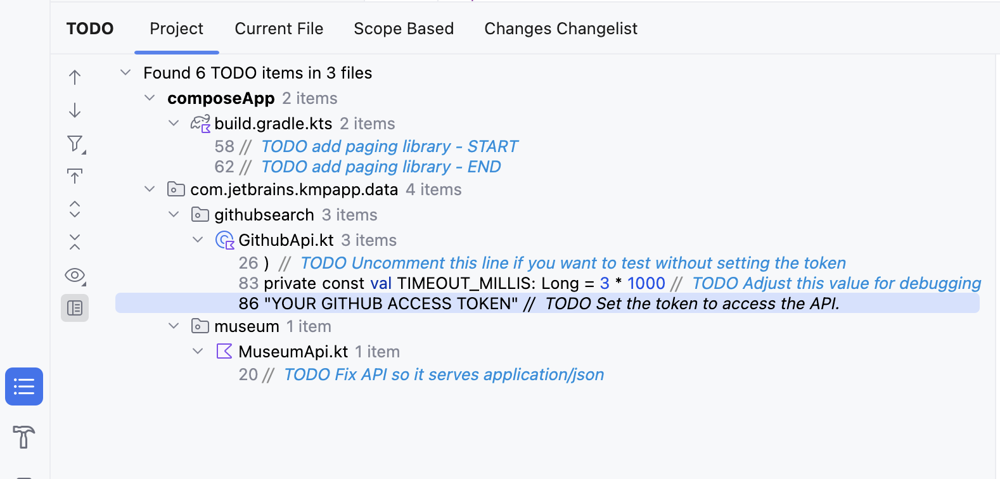
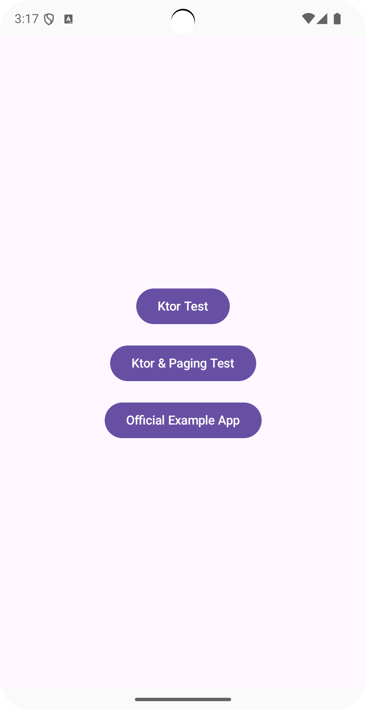
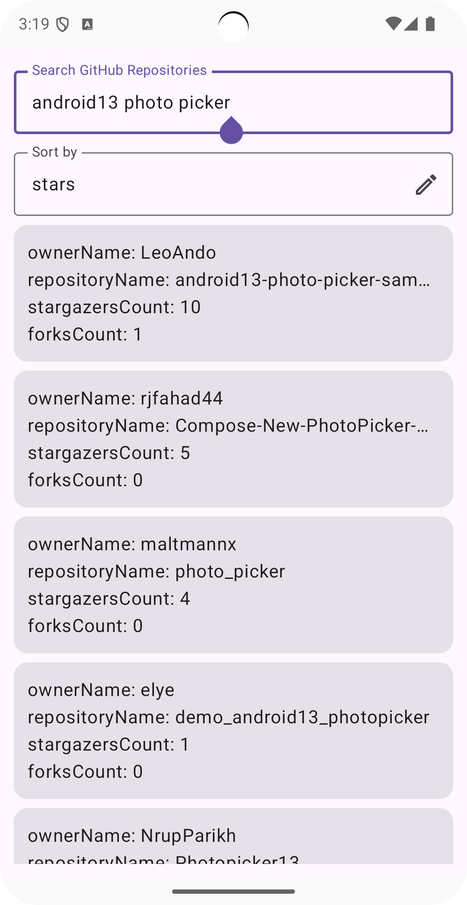
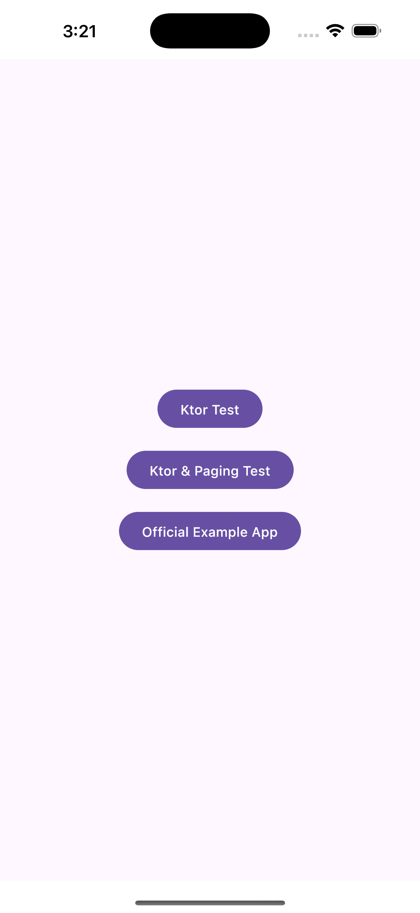
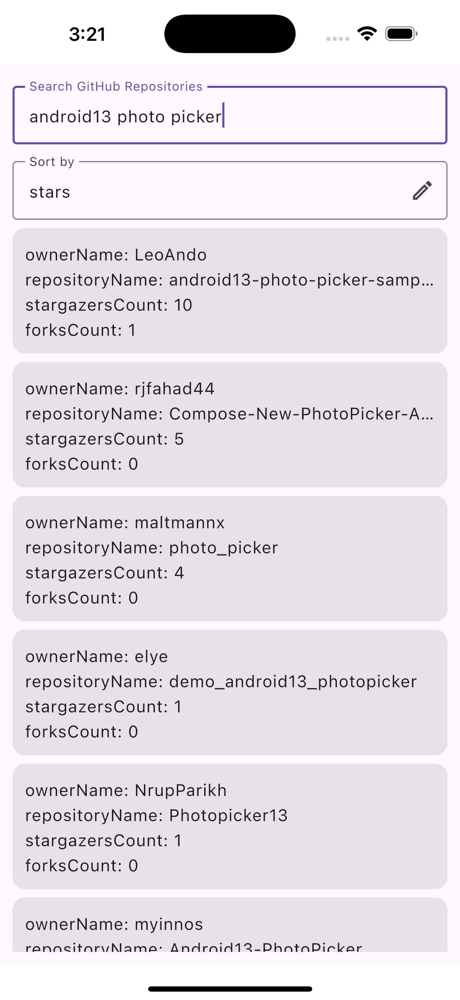

# base project (commit hash)

https://github.com/Kotlin/KMP-App-Template<br>
https://github.com/Kotlin/KMP-App-Template/commit/4d0a6a33b312ac78a336cdf4ead1d0debb6c9ba5

# development environment

```shell
Android Studio Meerkat Feature Drop | 2024.3.2
```

# Please Check TODO comments



# capture Android Pixel Fold API 35




# capture iPhone 16 Pro Max iOS 18.4





