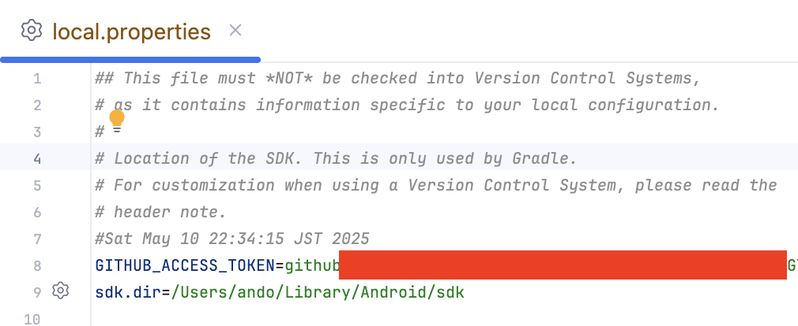
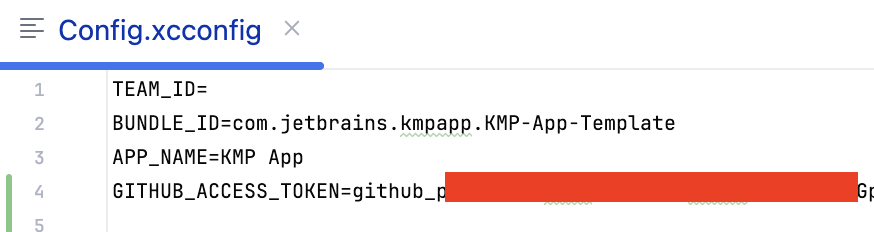
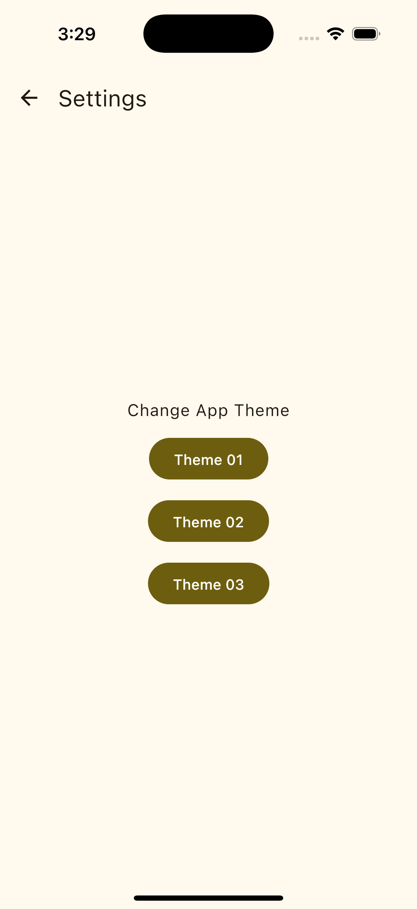
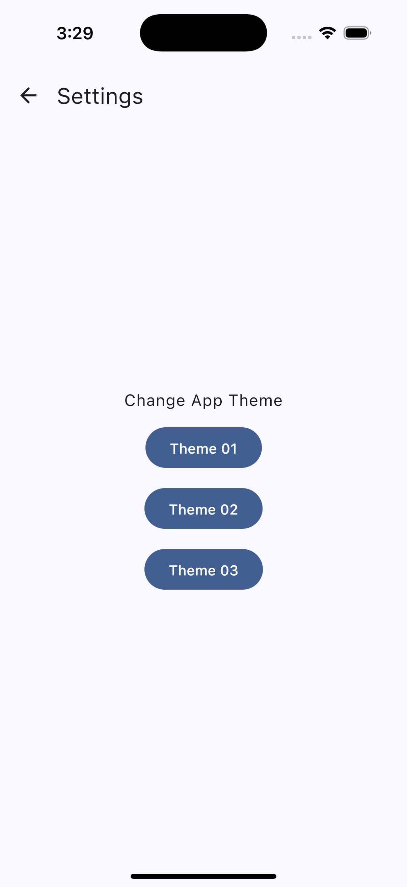
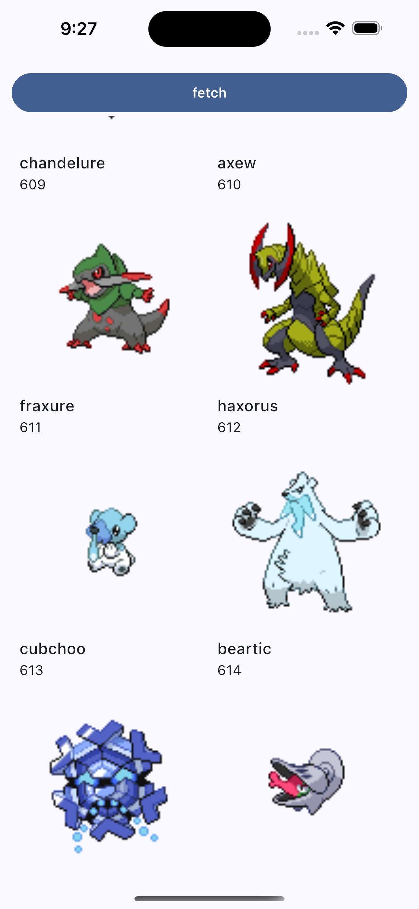

# base project (commit hash)

https://github.com/Kotlin/KMP-App-Template<br>
https://github.com/Kotlin/KMP-App-Template/commit/0d4ee4c179274cab1ddf2ef2da80398b9fef6573

# development environment

```shell
Android Studio Meerkat Feature Drop | 2024.3.2
```

# setup
## Android: Set the Github access token in KMP-App-Template/local.properties


## iOS: Set the Github access token in KMP-App-Template/iosApp/Configuration/Config.xcconfig
Create Config.xcconfig based on Config.xcconfig.sample and add the following setting value for GITHUB_ACCESS<br>


# Please Check TODO comments


# capture Android Pixel Fold API 35

|                    1                     |                     2                      |
|:----------------------------------------:|:------------------------------------------:|
|  |  |

# capture iPhone 16 Pro Max iOS 18.4
|                    1                     |                     2                      |
|:----------------------------------------:|:------------------------------------------:|
|  |  |

## feature:Change App Theme (Use Preferences Datastore) 
|                     1                      |                     2                      |
|:------------------------------------------:|:------------------------------------------:|
|  |  |

## Pokemon API (Use Ktor) 
|                     1                      |                     2                      |
|:------------------------------------------:|:------------------------------------------:|
|  | - |
