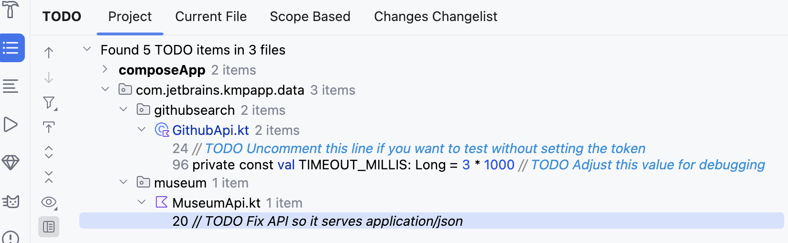
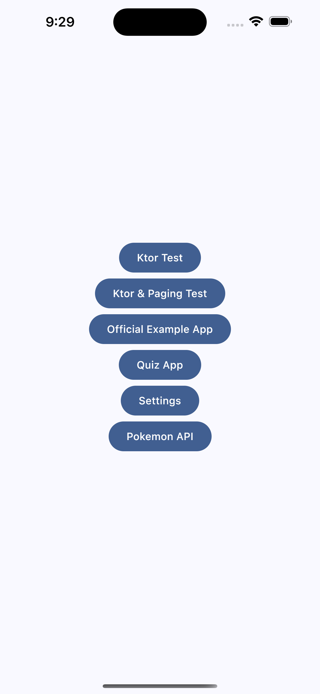

# Kotlin Multiplatform app template

[](https://confluence.jetbrains.com/display/ALL/JetBrains+on+GitHub)
[](https://opensource.org/licenses/Apache-2.0)

This is a basic Kotlin Multiplatform app template for Android and iOS. It includes shared business logic and data handling, and a shared UI implementation using Compose Multiplatform.

> The template is also available [with native UI written in Jetpack Compose and SwiftUI](https://github.com/kotlin/KMP-App-Template-Native).
>
> The [`amper` branch](https://github.com/Kotlin/KMP-App-Template/tree/amper) showcases the same project configured with [Amper](https://github.com/JetBrains/amper).


### Technologies

The data displayed by the app is from [The Metropolitan Museum of Art Collection API](https://metmuseum.github.io/).

The app uses the following multiplatform dependencies in its implementation:

- [Compose Multiplatform](https://jb.gg/compose) for UI
- [Compose Navigation](https://www.jetbrains.com/help/kotlin-multiplatform-dev/compose-navigation-routing.html)
- [Ktor](https://ktor.io/) for networking
- [kotlinx.serialization](https://github.com/Kotlin/kotlinx.serialization) for JSON handling
- [Coil](https://github.com/coil-kt/coil) for image loading
- [Koin](https://github.com/InsertKoinIO/koin) for dependency injection

> These are just some of the possible libraries to use for these tasks with Kotlin Multiplatform, and their usage here isn't a strong recommendation for these specific libraries over the available alternatives. You can find a wide variety of curated multiplatform libraries in the [kmp-awesome](https://github.com/terrakok/kmp-awesome) repository.


# development environment

```shell
Android Studio Narwhal Feature Drop | 2025.1.3 Nightly 2025-07-13
```

# setup
## Android: Set the Github access token in KMP-App-Template/local.properties


## iOS: Set the Github access token in KMP-App-Template/iosApp/Configuration/Config.xcconfig
Create Config.xcconfig based on Config.xcconfig.sample and add the following setting value for GITHUB_ACCESS<br>


# Please Check TODO comments



# capture Android Pixel Fold API 35

|                    1                     |                     2                      |
|:----------------------------------------:|:------------------------------------------:|
|  |  |

# capture iPhone 16 Pro Max iOS 18.4
|                    1                     |                     2                      |
|:----------------------------------------:|:------------------------------------------:|
|  |  |

## feature:Change App Theme (Use Preferences Datastore)
|                     1                      |                     2                      |
|:------------------------------------------:|:------------------------------------------:|
|  |  |

## Pokemon API (Use Ktor)
|                     1                      |                     2                      |
|:------------------------------------------:|:------------------------------------------:|
|  |  |